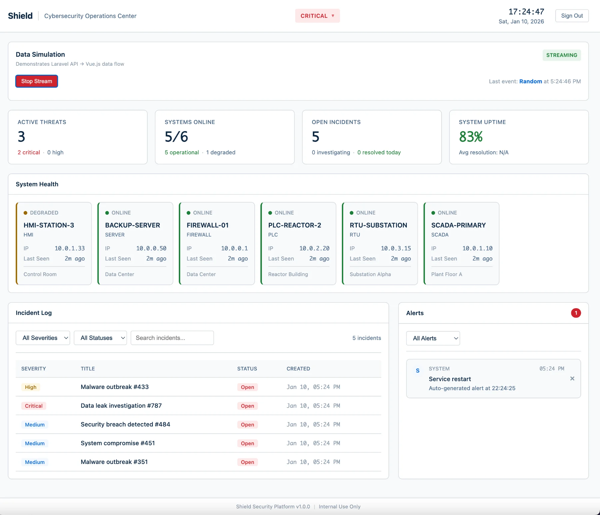
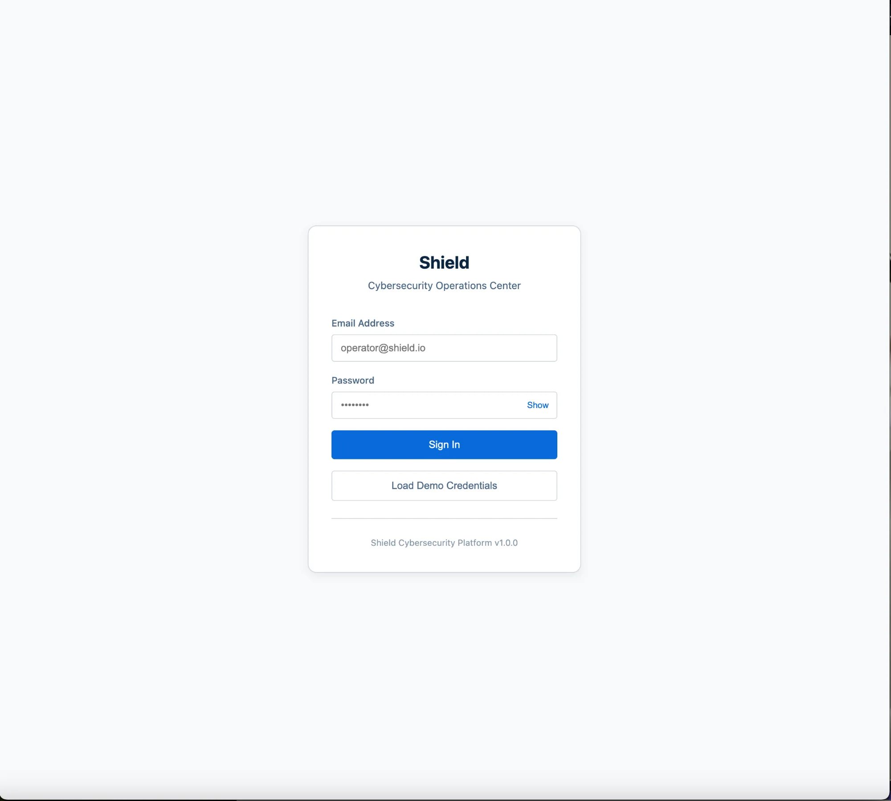
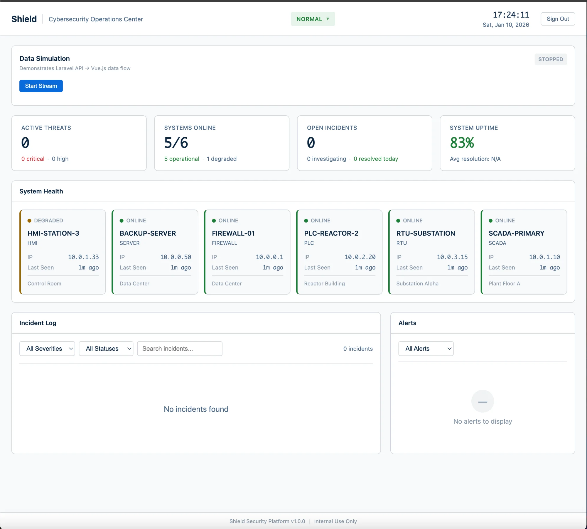
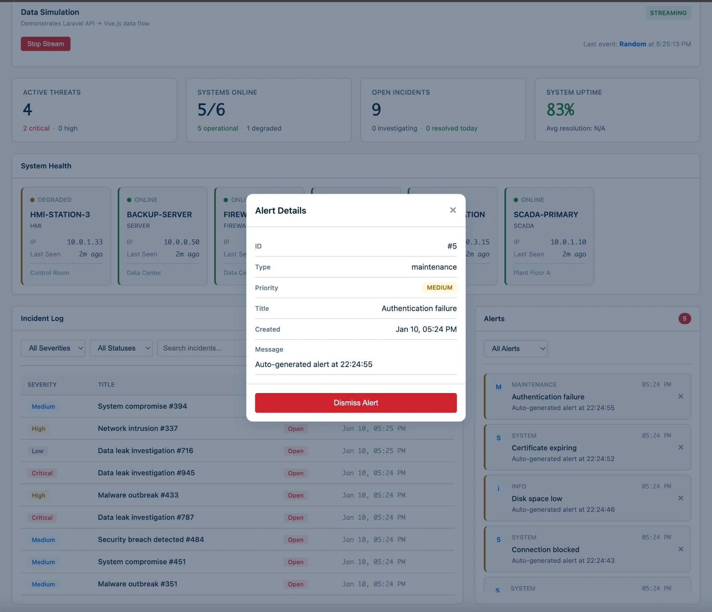
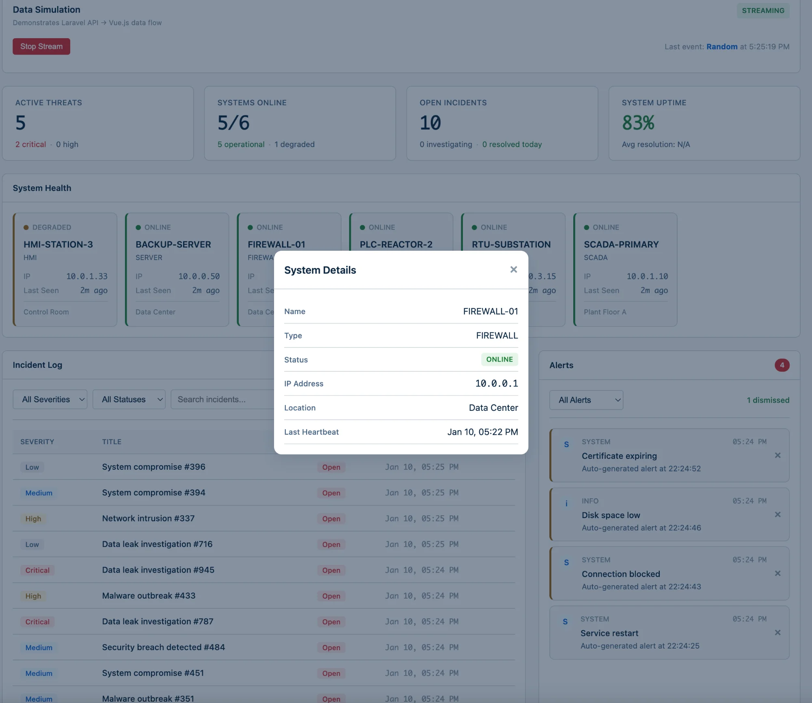

# Shield

**Cybersecurity Operations Center Dashboard**

A full-stack cybersecity portal built with Vue.js 3 and PhP Laravel 11. The followiing tool presents demo simulation of systems, incidents, alerts, and threats for critical infrastructure environments, randomly generated in a given time period, where monitoring is selected in intervals of 1-3 seconds. 


If want to see the live web app, hosted on Railway:

https://shield-frontend-production.up.railway.app/shield-frontend/

To interface with the live working web app, press <u>Load Demo Credentials</u> and feel free to explore.

This repository showcases, if of interest, running applicaiton in local environment.:



## Features

- **Real-time Dashboard** - Live updates every 5 seconds with system health, incidents, alerts, and threat monitoring
- **Dynamic Status Indicator** - Automatic NORMAL/WARNING/CRITICAL status based on open incident count
- **Incident Management** - Create, view, and resolve security incidents
- **Alert System** - Monitor and dismiss security alerts with priority levels
- **System Health Monitoring** - Track status of critical infrastructure systems (SCADA, PLCs, RTUs, Firewalls, etc.)
- **Data Simulation** - Built-in stream simulation for demo/testing purposes
- **Authentication** - Secure login with Laravel Sanctum token-based auth

## Screenshots

### Login


### Dashboard - Normal Status


### Dashboard - Critical Status (Streaming)


### Incident Details


### Alert Details


### System Details


## Tech Stack

**Backend:**
- Laravel 11
- SQLite
- Laravel Sanctum (Authentication)

**Frontend:**
- Vue.js 3 (Composition API)
- Pinia (State Management)
- Vue Router
- Axios
- Vite

## Installation

### Prerequisites
- PHP 8.1+
- Composer
- Node.js 18+
- npm


## Project Structure

```
shield/
├── backend/
│   ├── app/
│   │   ├── Http/Controllers/
│   │   │   ├── AuthController.php
│   │   │   ├── DashboardController.php
│   │   │   ├── IncidentController.php
│   │   │   ├── AlertController.php
│   │   │   ├── SystemController.php
│   │   │   ├── ThreatController.php
│   │   │   └── SimulationController.php
│   │   └── Models/
│   ├── database/
│   │   ├── migrations/
│   │   └── seeders/
│   └── routes/
│       └── api.php
│
└── frontend/
    ├── src/
    │   ├── components/
    │   │   ├── AlertPanel.vue
    │   │   ├── IncidentLog.vue
    │   │   ├── SimulationPanel.vue
    │   │   └── SystemHealth.vue
    │   ├── views/
    │   │   ├── Dashboard.vue
    │   │   └── Login.vue
    │   ├── stores/
    │   │   └── auth.js
    │   ├── services/
    │   │   └── api.js
    │   └── router/
    │       └── index.js
    └── index.html
```


### Backend Setup

```bash
cd backend
composer install
cp .env.example .env
php artisan key:generate
touch database/database.sqlite
php artisan migrate:fresh --seed
php artisan serve --port=8000
```

### Frontend Setup

```bash
cd frontend
npm install
npm run dev
```

### Access

- **URL:** http://localhost:5173
- **Login:** `operator@shield.io` / `demo123`


## API Endpoints

All routes are defined in `backend/routes/api.php`

### Authentication
`backend/app/Http/Controllers/AuthController.php`

- `POST /api/auth/login` - Login
- `POST /api/auth/logout` - Logout (requires auth)
- `GET /api/auth/me` - Get current user (requires auth)

### Dashboard
`backend/app/Http/Controllers/DashboardController.php`

- `GET /api/dashboard/stats` - Get dashboard statistics

### Incidents
`backend/app/Http/Controllers/IncidentController.php`

- `GET /api/incidents` - List incidents
- `POST /api/incidents` - Create incident
- `PATCH /api/incidents/{id}` - Update incident
- `DELETE /api/incidents/{id}` - Delete incident

### Alerts
`backend/app/Http/Controllers/AlertController.php`

- `GET /api/alerts` - List alerts
- `DELETE /api/alerts/{id}` - Dismiss alert

### Systems
`backend/app/Http/Controllers/SystemController.php`

- `GET /api/systems` - List systems
- `GET /api/systems/{id}` - Get system details

### Threats
`backend/app/Http/Controllers/ThreatController.php`

- `GET /api/threats` - List threats
- `GET /api/threats/{id}` - Get threat details
- `POST /api/threats/{id}/acknowledge` - Acknowledge threat
- `POST /api/threats/{id}/resolve` - Resolve threat
- `DELETE /api/threats/{id}` - Delete threat

### Simulation
`backend/app/Http/Controllers/SimulationController.php`

- `POST /api/simulate/random` - Generate random event
- `POST /api/simulate/threat` - Generate threat
- `POST /api/simulate/alert` - Generate alert
- `POST /api/simulate/incident` - Generate incident
- `POST /api/simulate/systems` - Seed systems

## Status Logic

The dashboard status automatically updates based on open incidents:

| Open Incidents | Status |
|----------------|--------|
| 0 | NORMAL (green) |
| 1-4 | WARNING (yellow) |
| 5+ | CRITICAL (red) |

Status can also be manually overridden by clicking the status badge.

Disclaimer: to create spereate github repositories to host on Railway.

Frontend Hosted on Railway: https://github.com/GChief117/shield-frontend
Backend Hosted on Railway: https://github.com/GChief117/shield-backend

## License

MIT

---

Built for critical infrastructure security monitoring and demonstration purposes.
